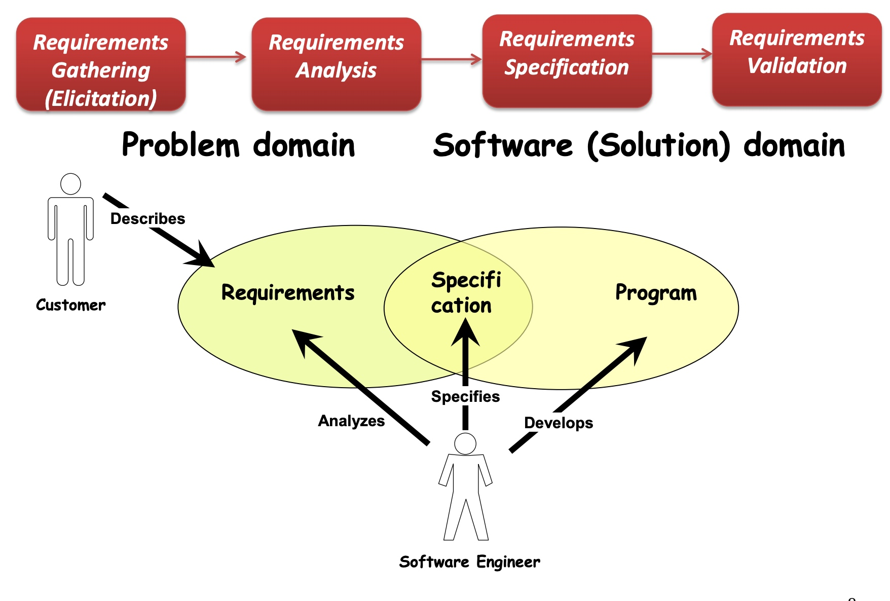
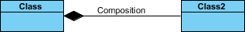

# COMP1531 Software Engineering Fundamentals

## Week 01: Introduction

### Basic Git Commands

A common workflow:

```shell
\\ Create a remote git repo
git init
git remote add origin <link>
\\ or git clone <link>


\\ Pull from a remote git repo
git pull

\\ Start a new development branch
git branch <new_branch>
git checkout <new_branch>
\\ or we can just use git checkout -b <new_branch>

\\ Develop on the new branch
...
git add <file_name>
git commit

\\ Merge and delete the new branch
git checkout master
git merge <new_branch>
git branch -d <new_branch>

\\ Push local repo to remote repo
git push -u <remote_branch> <local_branch>
\\ git push -u origin first_new_branch
\\ to push a local new branch to remote repo
```

## Week 02: Requirements Engineering

### Requirements

***Requirement***: “A condition or capability needed by a <u>user</u> to solve a problem or achieve an objective.” 

- user
- benefit 

#### Functional & Non-Functional requirements

***Functional Requirement***: Defines the functionality of the “system-to-be”: the <u>set of services</u> provided by the system and is typically described as:

- ***Input***: What inputs the system should accept and under what conditions
- ***Behaviour***: The behaviour of the system
- ***Output***: What outputs the system must produce and under what conditions

***Non-Functional Requirement***: Describe the <u>***quality*** attributes</u> of the “system-to-be”

- The *<u>constraints of the functionality</u>* provided by the system  e.g. security, reliability, maintainability, efficiency, portability, scalability
- ***Metrics*** for Non-functional requirements: we must have a measurable way to assess if the requirement is met
  - ***Performance*** ( <u>user response time</u> or network latency measured in seconds, transaction rate, total cost )
  - ***Reliability*** (MTBW – mean time between failures, downtime probability, failure rate, availability)
  - ***Usability*** (training time, number of clicks)
  - ***Portability*** (% of non-portable code)

### Requirements Engineering

Requirements Engineering is:

- A <u>*set of activities*</u> concerned with identifying and communicating the purpose of a software system and the context it will be used
- A <u>*negotiation process*</u>, where 
  - potential “users” of the system explore the requirements, agreeing what they <u>want</u> and what they <u>need</u> and 
  - software engineers formulate a <u>well-defined problem</u> to solve, where a well-defined problem consists of requirements

Participants in Requirements Engineering

1. End Users
2. Customers
3. Design team

#### Phases of Requirements Engineering

1. ***Requirements Gathering*** (Elicitation)
2. ***Requirements Analysis*** (Vision statement)
3. ***Requirements Specification*** (User-cases, User-stories, prototypes … SRS: System Requirements Specification)
4. ***Requirements Validation***



These four phases are not necessarily done in sequence.

#### Techniques in Requirements Analysis

Two main popular techniques:

1. ***Use-case modelling***
2. ***User-stories*** (Agile requirements analysis)

### User Stories

A user story is a short, concise description of a feature narrated from the perspective of the person who desires the capability, containing just enough information so that the developers can produce a reasonable estimate of the effort to implement it.

***RGB (Role, Goal, Benefit) Template***: One technique to create a user-story is to follow the **role-feature-reason** template. “As a [type of user], I want some [feature] so that [some reason]." This technique keeps the focus on <u>who, what, and why</u>.

### Acceptance criteria

Acceptance criteria are statements of requirements described from the perspective of the customer to determine what is required for the business and product owner to accept the user story as being “done”.

Typically, an acceptance criteria can be specified in the format: "When  **inputX** and  **processY**, then  **outcomeZ**."

### Epic Stories

### Use Case Modelling

#### Use Case

- As use cases helps a user to achieve goals, each use- case name must include a “verb” capturing the goal achievement e.g., “withdraw cash”
- Each use-case description represents a *dialog*, where the user initiates *actions* and the system responds with *reactions*
- Each use-case specifies <u>what information must pass the boundary of the system</u> in the course of a dialog (without considering what happens inside the system)

#### Use case Diagram


Two Types of Actors:
- ***Initiating actor*** (also called primary actor or simply “user”, normally on the left side of the diagram): initiates the use case to achieve a goal
- ***Participating actor*** (also called secondary actor, normally on the right side of the diagram): participates in the use case but does not initiate it.
    - helps the system-to-be to complete the use case

Labels:
- interaction between actors and use cases: <<initiate>> & <<participate>>
- interaction between use cases: <<include>> & <<extend>>

==Direction==: the relationship has to be read alongside the direction of the arrow.


#### `<<include>>` and `<<extend>>`

`<<extend>>` is an optional use case, like "get help from staff".


#### Abstraction and Generalization

in order to reduce redundancy

#### Traceability Matrix


## Week03 The Art of Writing User-Stories

### User-stories

#### Attributes of a good user-story: ==INVEST==

- Independent: Ideally, a user-story must be self-contained, independent (no inherent dependency on other PBI).
- Negotiable
- Valuable: The user-story must have value to the customer and the business.
- Estimable/Small: Stories need to be clear enough to estimate without being too detailed. (Break a large EPIC into precise, estimable, atomic user-stories)
- Testable: Need clarity on the story specific “done criteria”

#### User-Stories vs Use-Cases

- UC are more formal than US.
- US and UC serve different purposes: UC serve as a document contract, while US are placeholders for conversation
- US and UC vary in longevity: UC tend to be permanent artifacts, while US may be thrown out

#### Agile Requirements Engineering - Summary


### Domain Modelling using Object Oriented Design Techniques

#### Domain Modelling

Difference between Requirements Analysis and Domain modelling:
- Requirements analysis determines “external behaviour“ (WHAT are the features of the system-to-be)
- Domain modelling determines “internal behaviour” (HOW elements of system-to-be interact to produce the external behaviour)
- Requirements analysis and domain modelling are mutually dependent - domain modelling supports clarification of requirements, whereas requirements help building up the model.

Use Cases vs. Domain Model: black box vs. white box


Benefits of a Domain model: Importantly, the common language resulting from the domain model, <u>fosters unambiguous shared understanding</u> of the problem domain and requirements among business visionaries, domain experts and developers.

How do we create a domain model? One widely adopted technique is based on the
***object-oriented design*** paradigm.

#### OO design

Every object has:
- attributes: properties of the object e.g., model number,
colour, registration of a car or colour, age, breed of a dog
- behaviour – what the object can do (or methods) e.g., a duck can fly, a dog can bark, you can withdraw or deposit into an account

Two key principles of OO design:
- Abstraction: focusing on the common properties and behaviours of objects
- Encapsulation: hiding the object state (attributes)


##### Object collaboration

- Objects interact and communicate by sending messages to each other
- Objects play a client and server role and could be located in the same memory space or on different computers
- If object A wants to invoke a specific behaviour on object B, it sends a message to B requesting that behaviour

This message is typically made of 3 parts:
- The *object* to whom the message is addressed
- The *method* you want to invoke on the object
- Any *additional information* needed

##### Relationships between classes

1. ***Inheritance***
    - parent class / subclass
2. ***Association***: If two classes in a model need to communicate with each other, there must be link between them.
    - 2 special cases of association:
        - ***Aggregation***: The contained item is an element of a collection but it can also exist on its own, like a student at a university.
        - ***Composition***: The contained item is an integral part of the containing item, and it cannot exist without a container like a brain in a person.
        - Key difference: Composition is a stronger type of relationship.
    - Different numbers:
        - one-to-one
        - one-to-many or many-to-one
        - many-to-many


We see the following relationships:
- owners feed pets, pets please owners (association)
- a tail is a part of both dogs and cats (aggregation / composition)
- a cat is a kind of pet (inheritance / generalization)





##### UML

UML stands for Unified Modelling Language (http://www.uml.org/) Programming languages not abstract enough for OO design.
An open source, graphical language to model software solutions, application structures, system behaviour and business processes.

UML diagram categories:
- Structure Diagrams
    − show the static structure of the system and its parts and how these parts relate to each other
    − they are said to be static as the elements are depicted irrespective of time (e.g. class diagram)
- BehaviourDiagrams
    - show the dynamic behaviour of the objects in the system i.e. a series of changes to the system over a period of time
(e.g. use case diagram or sequence diagram)
    - a subset of these diagrams are referred to as interaction diagrams that emphasis interaction between objects (e.g., an activity diagram)


#### UML notations for OOP$$


- `-` means not accessible

Parent class and subclass:


Aggregation and Composition:


#### Domain Modelling Techniques: CRC cards

CRC stands for Class, Responsibility and Collaboration 

1. ***Class***:
    - An object-oriented class name, represents a collection of similar objects
2. ***Responsibility***:
    - What does this class know? (field)
    - What does this class do? (method)
3. ***Collaboration***:
    - Relationship to other classes (What classes does this class use?)

Steps to create a CRC model:
- Read the description
- Identify core classes ( look for nouns)
- Create a card per class ( start with just class names)
- Add responsibilities ( look for verbs )
- Add collaborations
- Add more classes as you discover them
- Refine by identifying inheritance etc.

A neat technique: a ***Scenario Walk-through***.
- Select a set of scenarios (use cases).
- Choose a plausible set of inputs for each scenario.
- Manually “execute” each scenario.
- Start with initial input for scenario and find a class that has responsibility for responding to that input.
- Trace through the collaborations of each class that participates in satisfying that responsibility.
- Make adjustments and refinements as necessary.