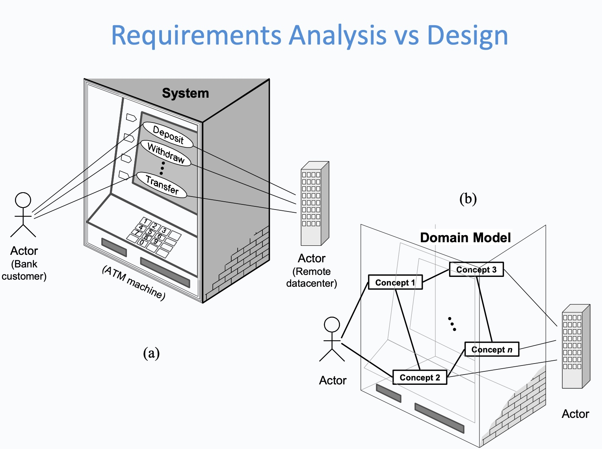

# COMP1531 Week01: Software Engineering Fundamentals

## Introduction to Software Engineering

### What is Software Engineering

“***Software Engineering***” is a discipline that enables customers to achieve <u>**business goals**</u> through developing software-based systems to solve their <u>**business problems**</u>.
- This discipline places great emphasis on the <u>***methodology***</u> for managing the development process, The methodology is commonly referred to as *<u>Software Development Life-Cycle (SDLC)</u>*.

#### Difference between Software Engineering and Programming

Software engineering:

- **<u>Understanding</u>** the business problem (understanding the interaction between the system-to-be, its users and environment)
- <u>**Creative formulation**</u> of ideas to solve the problem based on this understanding
- **<u>Designing</u>** the “blueprint” or architecture of the solution

Programming: <u>**Implementing**</u> the “blueprint” designed by the software engineer 

### Role of a software engineer

Software engineer thus acts as a bridge from

1. customer **needs** (problem domain) to 
2. programming **implementation** (solution domain). 

This enables the software engineer to design solutions that accurately target the customer's needs, that is, deliver **value** to the customer.

#### Why do we need SE?

- Software development is a *complex process*, so building software requires a discipline, to ensure that the product delivered realises customer goals.
- Software is *intangible* and software development requires *imagination*.
- Software errors, poor design and inadequate testing have led to loads of bugs.

## Software Development Life-Cycle (SDLC)

This methodology is essentially a framework to structure, plan and control the development of the software system and typically consists of the following phases:

1. Analysis and Specification
2. Design
3. Implementation
4. Testing
5. Release & Maintenance

#### Analysis

Discover and learn about the ***problem domain*** and the “***system-to-be***” where software engineers need to: 

- Understand ***behavioural characteristics*** or ***external behaviour***
- Determine both ***functional*** (inputs and outputs) and ***nonfunctional requirements***
- Employ ***Use-case modelling***, ***user-stories*** are popular techniques for analysing and documenting the customer requirements

#### Design

Search how to implement all of the customer’s requirements: produce ***Software blue-prints*** / ***Domain Modelling***

- *use-case diagram*
- *class diagram*
- component diagram

#### Implementation

Encode the design in a programming language to deliver a software product.

#### Testing

Verify that the system works correctly and realises the goals.

Testing process encompasses:

- *unit tests* (individual components are tested)
- *integration tests* (the whole system is testing)
- *user acceptance tests* (the system achieves the customer requirements)

Test-driven development: writes test programs before developing.

#### Release & Maintenance:

Deploying the system, fix defects and adding newfunctionality

## Software Development Methodologies

A software development methodology prescribes how the different phases in SDLC are carried out and can be grouped into two broad categories:
- ***Waterfall Process*** 
    - A linear process, where the various SDLC phases are carried out in a sequential manner
    - <u>Detailed and heavy **documentation**</u>
    - Suitable for **risk-free** projects with **stable** product statement, clear, well-known requirements
- ==***Iterative & Incremental processes*** (like *Agile*)==
    - which develop increments of functionality and repeat in a feedback loop
    - Customers can provide feedback to each increment, and product can be adapted.
    - Examples :methods that are more aggressive in terms of <u>short iterations</u>
      - *Unified Software Development Process, Rational Unified Process* 
      - ***Agile methods***
      - ***XP*** (Extreme Programming)
