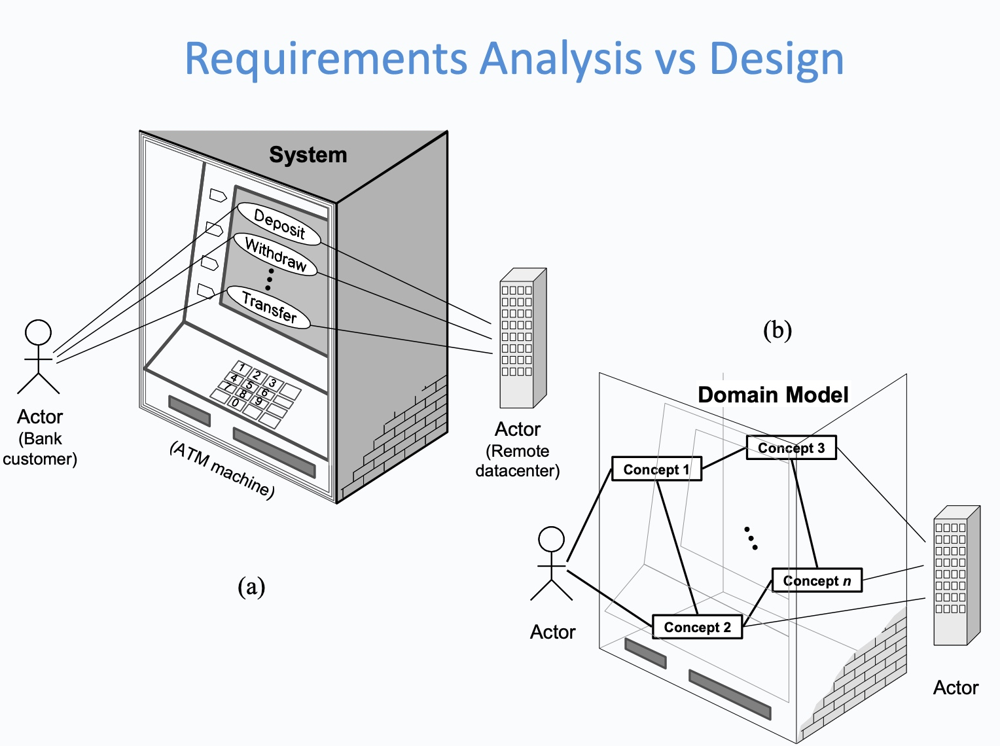
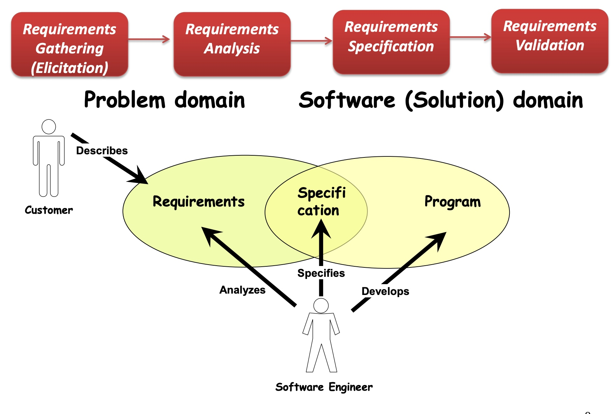
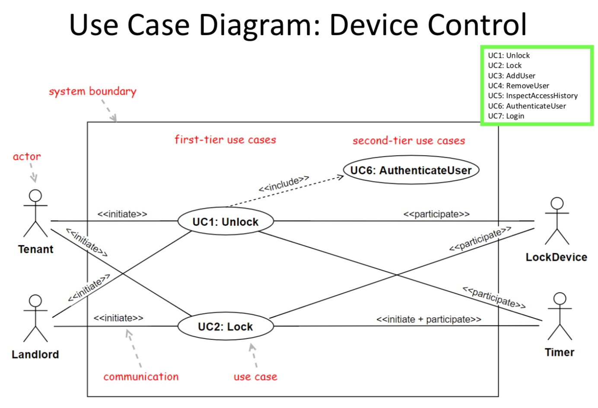
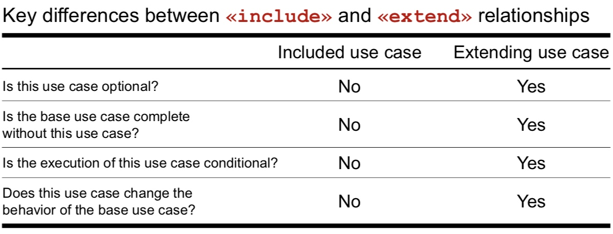

# COMP1531 Week02: Requirements Engineering

## Requirements

### What is a requirement?

***Requirement***: “A condition or capability needed by a <u>user</u> to solve a problem or achieve an objective.” 

- user
- benefit 

#### Functional & Non-Functional requirements

***Functional Requirement***: Defines the functionality of the “system-to-be”: the <u>set of services</u> provided by the system and is typically described as:

- ***Input***: What inputs the system should accept and under what conditions
- ***Behaviour***: The behaviour of the system
- ***Output***: What outputs the system must produce and under what conditions

***Non-Functional Requirement***: Describe the <u>***quality*** attributes</u> of the “system-to-be”

- The *<u>constraints of the functionality</u>* provided by the system  
  e.g. security, reliability, maintainability, efficiency, portability, scalability
- ***Metrics*** for Non-functional requirements: we must have a measurable way to assess if the requirement is met
  - ***Performance*** ( <u>user response time</u> or network latency measured in seconds, transaction rate, total cost )
  - ***Reliability*** (MTBW – mean time between failures, downtime probability, failure rate, availability)
  - ***Usability*** (training time, number of clicks)
  - ***Portability*** (% of non-portable code)

## Requirements Engineering

Requirements Engineering is:

- A <u>**set of activities**</u> concerned with identifying and communicating the purpose of a software system and the context it will be used.
- A <u>**negotiation process**</u>, where 
  - potential users explore the requirements, agreeing what they <u>want</u> and what they <u>need</u>
  - software engineers formulate a <u>well-defined problem</u> to solve (user story)

Participants in Requirements Engineering

1. End Users
2. Customers
3. Design team

### Phases of Requirements Engineering

1. ***Requirements Gathering*** (Elicitation)
2. ***Requirements Analysis*** (Vision statement)
3. ***Requirements Specification*** (User-cases, User-stories, prototypes … SRS: System Requirements Specification)
4. ***Requirements Validation***

These four phases are not necessarily done in sequence.

#### Requirements Gathering

A process where customers, end-users articulate, discover and understand their requirements

- Customers specify:
  - What is required?
  - How will the intended system fit into the context of their business
  - How the system will be used on a day-to-day basis?
- Developers understand the business context through meetings (what if this? What if that?), market research, questionnaires, focus groups etc.

The problem statement is rarely precise.

#### Requirements Analysis

- Start with the customer statement of requirements or the <u>vision statement</u>
- Refine and reason about the requirements elicited
- Scope the project, negotiate with the customer to determine the *priorities* - what is important, what is
  realistic
- Identify dependencies, conflicts and risk

Two main popular techniques in Requirements Analysis:

1. ***Use-case modelling***: Build a set of use-cases, to describe the tasks to be performed by the “system-to-be”
   - Each use-case represents a dialog between user andsystem, helping the user achieve a goal
   - In each dialog, user initiates an action, system responds with a reaction
   - Build elaborate user-scenarios for each use-case that describe the interaction between user and system
2. ***User-stories*** (Agile requirements analysis)

#### Requirements Specification

Document the functional and non-functional (quality and constraints of software-to-be) requirements using
formal, structured notations or graphical representation to ensure clarity, consistency and completeness.

e.g. Use-cases, User-stories, prototypes, formal mathematical models or a combination of these… OR
a formal SRS (System Requirements Specification)

#### Requirements Validation

- The process of confirming with the customer or user of the software that the specified requirements are valid, correct, and complete
- Ensure developer’s understanding of the problem matches the customer’s expectations

## User Story

A user story is a short, concise description of a feature narrated from the perspective of the person who desires the capability, containing just enough information so that the developers can produce a reasonable estimate of the effort to implement it.

###Who writes user stories?

- Anyone can write user-stories: ***product owner*** (<u>a key stakeholder with a clear vision of requirements and communicates this vision to the developers</u>) or team member
- But, it is the <u>product owner’s responsibility to make sure a ***product backlog of user stories*** exist</u>

### Granularity of a User Story

- ***Epic user stories*** – covers large amount of functionality and generally too large for an agile team to complete in one iteration
- ***Themes*** – A collection of related epic user-stories

- ***User Stories*** - split an epic user story into multiple smaller atomic stories, so the story is small enough to be coded and tested in one iteration

### Techniques to write a User Story

#### RGB Template

***RGB (Role, Goal, Benefit) Template***: One technique to create a user-story is to follow the **role-feature-reason** template. “As a [type of user], I want some [feature] so that [some reason]." This technique keeps the focus on <u>**who**, **what**, and **why**</u>.

#### Three C’s model

The three C’s model (Ron Jeffries, 2001), identifies three primary components of a user-story that helps business and technical team reach an agreement on the meaning of the user-story.

- a "**Card**", a simple statement usually written in the RGB format, addressing the “who”, “what” and “why” on an index-card.
- a “**Conversation**“, detailing the simple requirement; conversation can take place at different times in the project, enables development team to obtain a clearer understanding of how the feature will work in different situations, including error conditions, the value being provided; conversation is largely verbal but most often supplemented by documentation
- the “**Confirmation**", developers need to get confirmation regarding the acceptance criteria from the product owner; define the acceptance tests, that will be used to show that the story has been implemented correctly.

#### Important considerations for User Stories

- Assign each user-story **a unique identifier**
- Remember **non-functional requirements**
- **Indicate the estimated size** - assign user story points to each card, a relative indication of how long it will take a pair of programmers to implement the story.
- **Indicate the priority**

## Agile Requirements Engineering

Procedures for agile requirements engineering:

1. Start with ***visioning***
  - To identify the **Theme** or **Epic Stories**
  - What are the key features?
  - Who are the target users
  - What are the selling points of this product? (3-5 selling objectives)
2. ***Brainstorm*** to identify features of the **epics**
3. ***Breakdown*** features into small **user-stories**
4. ***Detail*** user-stories to yield iteration deliverables
   - Acceptance criteria
   - Screen sketches, Use case diagrams
   - UI Prototypes, Wire Frames (UI focussed projects)
   - Activity Diagrams (Process centred projects)
5. A final list of user-stories or ***product backlog*** of user-stories is created

Key points for agile requirement engineering:

- Design upfront a process for collaborative requirements gathering
- Identify and engage a **<u>product owner</u>** and knowledgeable subject **<u>SME</u>**s
- <u>Focus on **breadth** early, on depth later</u>
- Break down/slice epic stories to the right level, so the team has clarity on the requirement, but keep a ‘Just Enough For the Next Step’ attitude

## Use Case Modelling

Use Case Modelling is building a set of use-cases that describe the tasks to be performed by the “system-to-be” and the relation between these tasks and the outside world.

A use-case description represents a dialog between the
user and the system, with the aim of helping the user
achieve a goal.

Use cases signify what the system needs to accomplish,
not how; 

## Acceptance criteria

Acceptance criteria are statements of requirements described from the perspective of the customer to determine what is required for the business and product owner to accept the user story as being “done”.

Typically, an acceptance criteria can be specified in the format: "When  **inputX** and  **processY**, then  **outcomeZ**."

## Epic Stories

## Use Case Modelling

#### Use Case

- As use cases helps a user to achieve goals, each use- case name must include a “verb” capturing the goal achievement e.g., “withdraw cash”
- Each use-case description represents a *dialog*, where the user initiates *actions* and the system responds with *reactions*
- Each use-case specifies <u>what information must pass the boundary of the system</u> in the course of a dialog (without considering what happens inside the system)

#### Use case Diagram

Two Types of Actors:
- ***Initiating actor*** (also called primary actor or simply “user”, normally on the left side of the diagram): initiates the use case to achieve a goal
- ***Participating actor*** (also called secondary actor, normally on the right side of the diagram): participates in the use case but does not initiate it.
    - helps the system-to-be to complete the use case

Labels:
- interaction between actors and use cases: <<initiate>> & <<participate>>
- interaction between use cases: <<include>> & <<extend>>

==Direction==: the relationship has to be read alongside the direction of the arrow.

#### `<<include>>` and `<<extend>>`

`<<extend>>` is an optional use case, like "get help from staff".

#### Abstraction and Generalization

in order to reduce redundancy

#### Traceability Matrix

