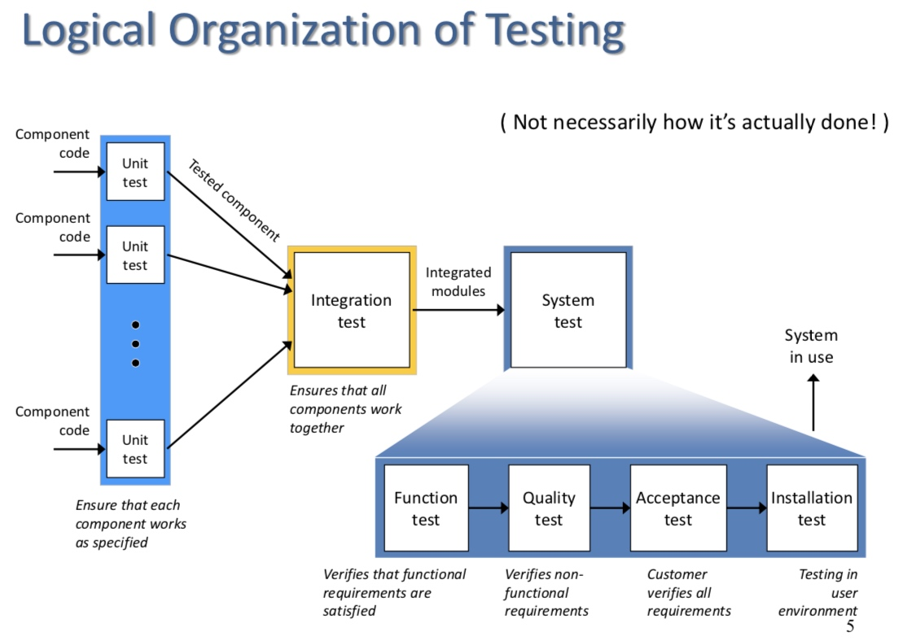
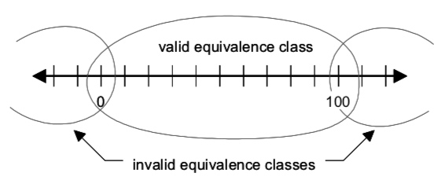
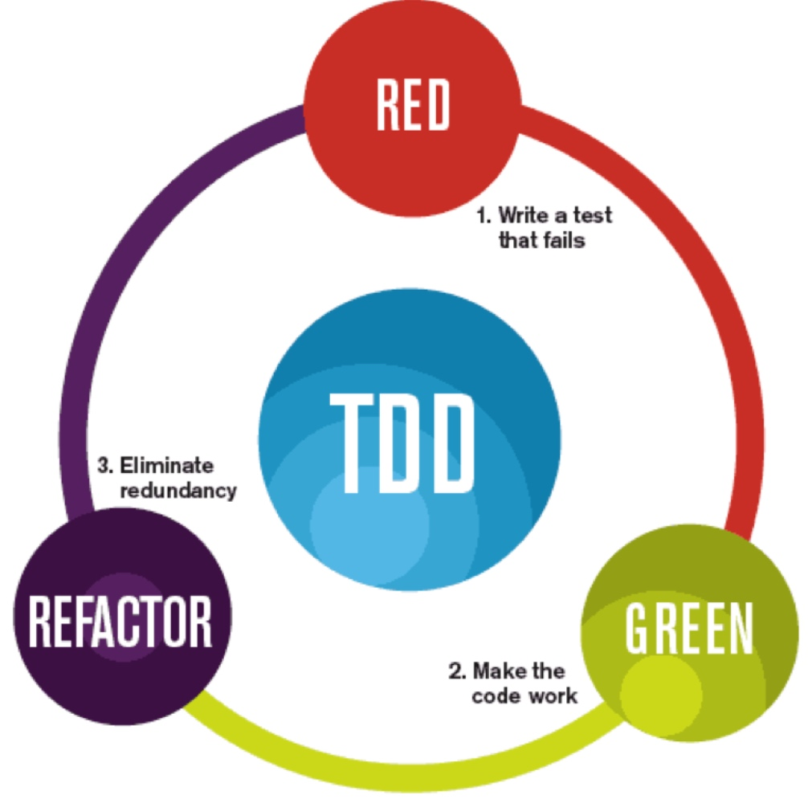

# COMP1531 Week05: Software Testing

## Overview of Software Testing

A ***fault***, also called "***defect***" or “***bug***”, is an erroneous hardware or software element of a system that can cause the system to fail (inadvertent bugs or malicious features.

### Logical Organization of Testing

Unit Test -> Integration Test -> System Test (Function Test -> Quality Test -> Acceptance Test)

#### Common Terminology

***Black box testing***:
- Tests with a set of inputs, <u>without looking at the implementation</u>
- A testing approach commonly adopted by customers, such as UAT

***White box testing***:
- Tests with test data, <u>with knowledge of implementation</u>   
(system architecture, algorithms used, program code)

***Regression testing***: (used in the agile development)
- Verifying software that was <u>previously developed and tested still performs</u>, after the program changed or its interfaces with other software
- Very important to ensure after an iteration, the previous functions still run correctly

## Test Coverage

***Test coverage*** measures the degree to which the specification or code of a software program has been exercised by tests.

***Code coverage*** measures the degree to which the source code of a program has been tested.

Code coverage criteria include:
- equivalence testing
- boundary testing
- control-flow testing
- state-based testing

### ==Equivalence Testing==

***Equivalence testing*** is a black-box testing method that divides the space of all possible inputs into <u>equivalence groups</u>, such that the program “behaves the same” on each group.

1. partitioning the values of input parameters into equivalence groups
2. choosing the test input values

Equivalence testing can ensure you test every possible cases by simplifying all the input into groups.

#### ==Boundary Testing==

***Boundary testing*** is a special case of equivalence testing that focuses on the boundary values of input parameters.
- Based on the assumption that developers often overlook special cases at the boundary of equivalence classes
- Selects elements from the “edges” of the equivalence class, or “outliers” such as zero, min/max values, empty set, empty string, and null, confusion between > and >=, etc.

### Control-flow Testing

- ***Statement coverage***: Each statement executed at least once by some test case
- ***Edge coverage***: Every edge (branch) of the control flow is traversed at least once by some test case
- ***Condition coverage***: Every condition takes `TRUE` and `FALSE` outcomes at least once in some test case
- ***Path coverage***: Finds the number of distinct paths through the program to be traversed at least once

## Test Driven Development (TDD)

***Refactor***: an important phase in the agile development, which improve the reusability of your codes by simplifying your codes

## Exception Handling

What is an exception?
- An *error* that happens during the execution of a program, causing a program to terminate abruptly
- Could be caused by providing wrong input to the data, run out of memory, file or network resources not available
- ==Different to *program bugs*==

In Python, we prefer to using `exception` rather than `assertion`.
- `assertion` can be turned off in some cases where assertions are disabled.
- ==Golden rule: Do not use assertions for <u>data validation</u>!==
- Assertions are mainly used to make sure your codes' logic is right.

