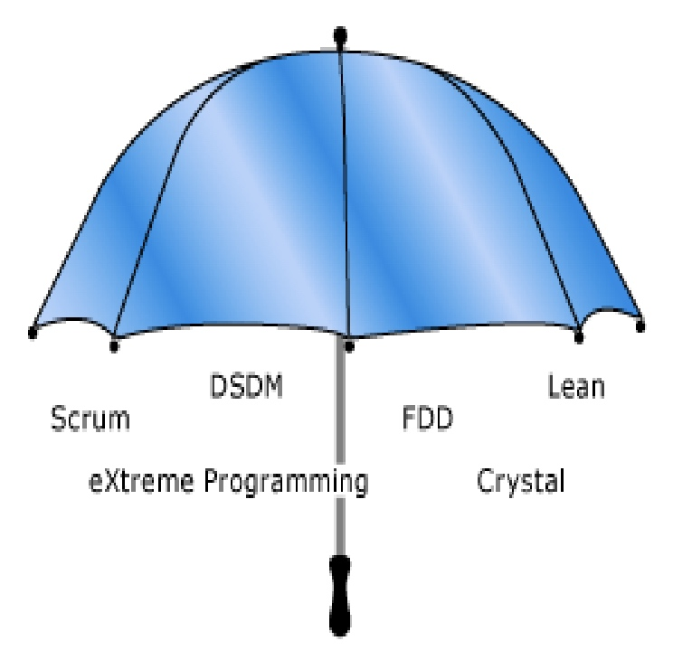
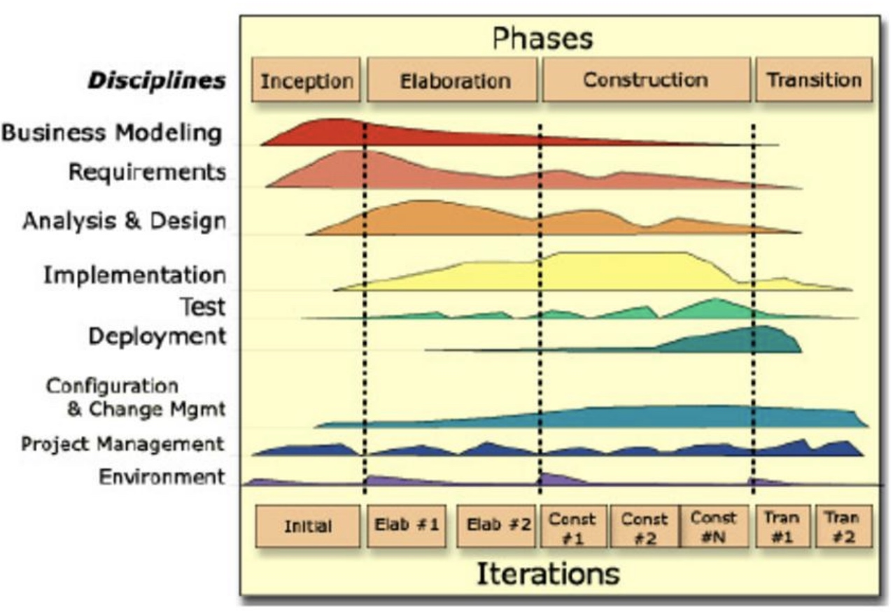
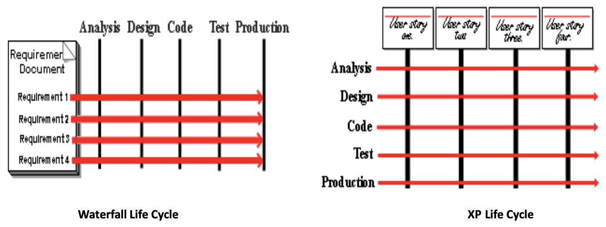

# COMP1531 Week06: Agile Development Methodologies

## Agile Software Development Methodologies 

### Bible: Agile Manifesto

We are uncovering better ways of developing software by doing it and helping others do it.

Through this work we have come to value:
- **Individuals and interactions** over processes and tools
- **Working software** over comprehensive documentation
    - "Simple Codes is better than Bad Documentation."
- **Customer collaboration** over contract negotiation
    - "Focus on customers' reaction"
- **Responding to change** over following a plan

That is, while there is value in the items on
the right, we value the items on the left more.

### Rational Unified Process (RUP)

An iterative software development process developed
by Ivar Jacobson, Grady Booch and James Rumbaugh
and consists of <u>4 major phases</u>:
- **Inception**: scope the project, identify major players, what resources are required, architecture and risks, estimate costs
- **Elaboration**: understand problem domain, analysis, evaluate in detail required architecture and resources
- **Construction**: design, build and test software
- **Transition**: release software to production

### Extreme Programming (XP)

A prominent agile software engineering methodology that:
- focuses on providing the value for the customer <u>in
the fastest possible way</u>
- acknowledges <u>changes to requirements</u> are natural and
inescapable
- places higher value on **adaptability** (to changing
requirements) over **predictability** (defining all
requirements at the beginning of the project)
- aims to lower the cost of change by introducing a set of
basic **principles** (*high quality, simple design and continuous
feedback*) and **practices** to bring more flexibility to changes

#### XP Core Principles

##### High Quality

- **Pair-programming** - Code written by pairs of programmers working together intensely at the same workstation, where one member of the pair “codes” and the other “reviews”.
- **Continuous Integration** - Programmers check their code in and integrate several times per day
- **Sustainable pace** - Moderate, steady pace
- **Open Workspace** – Open environment
- **Refactoring** – Series of tiny transformations to improve the structure of the system
- ==**Test-Driven Development**== - Unit-testing and User Acceptance Testing

##### Simple Design

- Focus on <u>the user stories in the current iteration</u> and keeps the designs simple.
- Migrate the design of the project from iteration to iteration to be the best design for the set of stories currently implemented
- Spike solutions, prototypes, CRC cards are popular techniques
during design

Three design mantras for developers:
- Simplest: Consider the <u>simplest possible design</u> for the current user stories (e.g., if the current iteration can work with flat file, then don’t use a database)
- Avoid Prediction: Resist the temptation to add the infrastructure before it is needed
- Code Once and only once – XP developers don’t <u>tolerate duplication of code</u>

##### Continuous Feedback

An XP team receives intense feedback in many ways, in many
levels (developers, team and customer)

- Developer: Developers receive constant feedback by working in pairs, constant testing and continuous integration
- Team - daily stand-up meetings: XP team receives daily feedback on progress and obstacles through daily stand-up meetings
- Customer: Customers get feedback on progress with user acceptance scores and demonstrations at the end of each iteration.
- XP developers deliver value to the customer through producing working software progressively at a “steady heartbeat” and receive customer feedback and changes that are “gladly” accepted.

#### XP vs WaterFall Life-Cycle

#### XP Planning Game

Key steps in XP Planning Game:
- Initial Exploration
- Release Plan
- Iteration Planning
- Task Planning 

##### Initial Exploration

- <u>**Conversations** between developers and customers</u> about 
    - the system-to-be
    - identify significant features (not “all” features)
- Break each feature into *user stories*
    - User-stories not only capture the user’s vision but also impact the planning process in two key areas: ***estimating*** and ***scheduling***
- *Estimate* the user story in *user story points* based on team’s ***velocity***
    - Stories that are too large or too small are difficult to estimate. An epic story should be split into pieces that aren't too big.
    - Developers complete a certain number of stories each week. Sum of the estimates of the completed stories is a metric known as ***velocity***
        - Developers have a more accurate idea of average velocity after 3 or 4 weeks, which is used to provide better estimates for ongoing iterations. 

##### Release Planning

Negotiate a **release date** (6 or 12 or 24 months in the future)
- Customers specify which user stories are needed and the order for the planned date (**business decisions**)
- Customers can’t choose more user stories than will fit according to the current project velocity
- Selection is crude, as initial velocity is inaccurate. RP can be adjusted as velocity becomes more accurate

Use the **project velocity** to plan:
- by time: compute #user stories that can be implemented before a given date ( multiply number of iterations by the project velocity
- by scope: how long a set of stories will take to finish divide the total weeks of estimated user stories by the project velocity

##### Iteration Planning

Use the release plan to create iteration plans
- Developers and customers together choose an iteration size: typically 1 or 2 weeks
- Customers can prioritise user stories from the release plan in the first iteration, but must fit the current velocity
- ==<u>Customers cannot change the stories in the **current iteration** once it has begun</u> (can change or reorder any story in the project except the ones in the current iteration)==
- <u>The iteration ends on the specified date, even if all the stories aren't done</u>. Estimates for all the completed stories are totalled, and velocity for that iteration is calculated
    - The planned velocity for each iteration is the measured velocity of the previous iteration.
    - Defining “done” - <u>A story is not done until all its acceptance tests pass</u>

##### Task Planning

Developers and customers arrange an ***iteration planning meeting*** <u>at the beginning of each iteration</u>
- Customers choose user stories for the iteration from the release plan but must fit the current project velocity
- <u>User stories are broken down into *programming tasks* and order of implementation of user stories within the iteration is determined</u> (technical decision)
- Developers may sign up for any kind of tasks and then estimate how long task will take to complete (developer’s budget – from previous iteration experience)
- Each task estimated as 1, 2, 3 (or even ½) days of ideal programming days. Tasks < 1 day grouped together, tasks > 3 days broken down
- Project velocity is used again to determine if the iteration is over-booked or not
- Time estimates in ideal programming days of the tasks are summed up, and this must not exceed the project velocity (initial or from the last iteration).
    - If the iteration has too much - the customer must choose user stories to be put off until a later iteration (snow plowing). If the iteration has too little then another story can be accepted.
    - ==The velocity in task days (iteration planning) overrides the velocity in story weeks (release planning) as it is more accurate.==
    - Team holds a meeting halfway through iteration to track progress

### Agile Drawbacks

Not ideal for 
- outsourcing, 
- clients and developers separated geographically, 
- business clients who simply don't have the manpower, resources