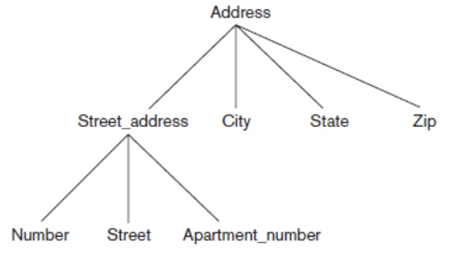
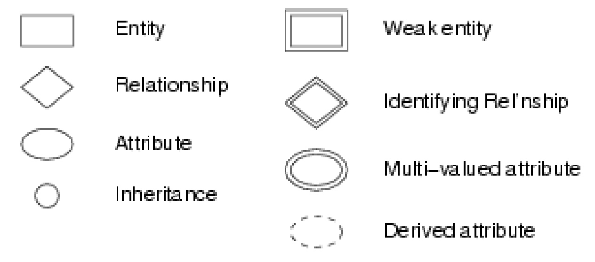
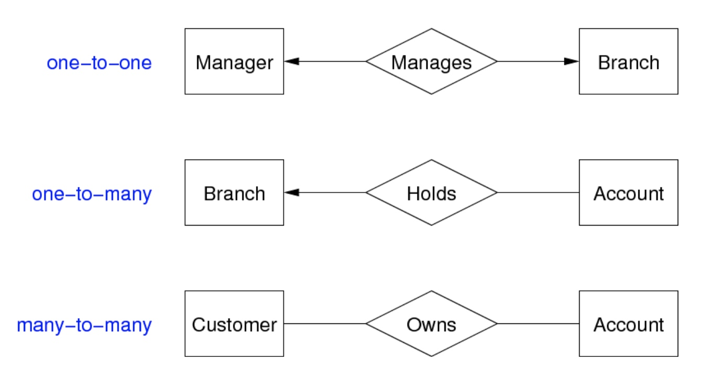
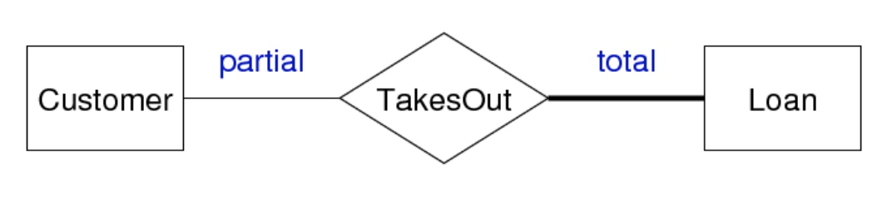

# COMP1531 Week08: Databases ER Model

## Data, Database and DBMS

***Data*** – facts that can be recorded and have implicit meaning.
This data needs to be:
- Stored (in a structured format)
- Manipulated (efficiently, usefully)
- Shared (by very many users, concurrently)
- Transmitted

A ***database*** represents a logically coherent collection of related data.

A ***database management system*** (DBMS) is a software
application that allows users to:
- create and maintain a database (DDL)
- define queries to retrieve data from the database
- perform transactions that cause some data to be written or deleted from the database (DML)
- provides concurrency, integrity, security to the database

A *database* and *DBMS* are collectively referred to as a ***database system***.

## Data Models

A *data model* describes how the data is structured in the database

There are several types of data models: 
- ***Relational model*** (most popular)
    - a data structure where data is stored as a set of records known as tables
    - each table consists of rows of information (also called a tuple)
    - each row contains fields known as columns
- **Document model**
    - data is stored in a hierarchical fashion e.g., XML, JSON
- **Object-oriented model** (similar to OOP)
    - a data structure where data is stored as a collection of objects
- **Object-Relational model**
    - a hybrid model that combines the relational and the objectoriented database models

## ER Model

### Entity Set

- ***Entity*** (aka entity instance): a thing or object of interest in the real-world and is distinguishable from other objects
- ***Attribute***: a data item or property of interest describing the entity
    - An ***key*** consists of a set of attributes whose set of values are distinct over entity set
- An ==***entity-set***== (aka. *entity-type*) can be viewed as either:
    - a set of entities <u>with the same set of attributes</u>
    - an <u>abstract</u> description of a class of entities e.g., students, courses, accounts 

Notes: 
1. ==No dup attributes in two different entity sets!==
2. ==For any 2 entities in one same entity-set, they cannot have the identical values for all attributes!== (which is feasible in OOP)

Analogy between ER and OO models:
- an *entity* is like an *instance*
- an *entity set* is like a *class*

#### Attributes of an entity-set

In contrast to relational model, attributes in an ER model can be:

Whether have subsets:
- ***Simple*** (attribute cannot be broken into smaller sub-parts)
- ***Composite*** (have a <u>hierarchy</u> of attributes)
    - e.g., Name = First name + Last name ,Address is a composite attribute 

Whether mapping to one or more entity:
- ***Single-valued*** (<u>one-to-one</u>, have only one value for each entity)
    - e.g., an vin_chassis attribute for an entity type CAR
    - ==Admin can query an entity by its single-valued attribute==
- ***Multi-valued*** (<u>one-to-many</u>, have more than one values for each entity)
    - e.g., each person can have lots of hobbies

#### Key

-  a key (***super-key***) : It is any set of *attribute*s
    -  whose set of values are distinct over entity set
    -  natural (e.g. name + address + birthday) or artificial (e.g.SSN)
- ***Candidate key***: a super-key whose no subset is also a superkey e.g. (`name + address`) is a super-key, but not (`name`) or (`address`)
- ==***Primary key***==: a candidate key designated by DB designer that uniquely identifies an entity  e.g., `SSN`

#### Weak Entity Set

A ***weak entity set***
- has no keys of its own
- ==exist only because of association with strong entities==

### Relationship Set

**Relationship**: relates two or more entities

***Relationship Set*** (aka. *relationship type*) : set of similar relationships, associating entities belonging to one entity set to another.

==Properties of Relationship Set:==
1. **Degree** = the number of entities involved in the relationship (in ER model, $≥ 2$) e.g, the degree of WORKS FOR is 2
2. **Cardinality** = # associated entities on each side of relationship e.g., the cardinality of WORKS FOR is N:1
3. **Participation-level** ("commitment"): Participation in relationship set R by entity set A may be
    - *total* - every $a \in A$ participates in $≥1$ relationship in R
    - *partial* - only some $a \in A$ participate in relationships in R

#### Relationship Set with attributes

### Subclasses and Inheritance

#### Subclass: overlapping and disjoint

### ==ER Diagram==

Overview:

Cardinality: 
1. One Manager can just manage one Branch, which also can be managed only by one Manager
2. One Branch holds many Accounts
3. Many Customers own Many Accounts

Participation-level:
All loans must take part in a TakeOut relationship, but customers may not take part in TakesOut relationship.

==The <u>Primary key</u> should be underlined in the ER Diagram!==

### Steps of creating an ER model