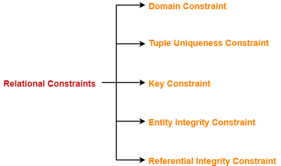

# COMP1531 Week09: Relational Data Model

ER Model -> Relational Model -> Database Schema -> Database DDL statements (to create a table)

## Database Schema

Database schema is a collection of relation schemas.

### Relation Schema

### Relational Constraints

- ***Domain Constraint***: set of all possible values
- ***Referential Integrity Constraint***: How a **Foreign Key** corresponds with a **Primary Key** in another table
- ***Key Constraint***: the key value should be unique
    - ***Primary Key Constraint***: the key value should be unique and not `NULL`

### ER to Relational Mapping

Summarising ER → Relational Mapping:

Key ideas:
1. Multi-valued attributes should be modelled as a new table.
2. For partial relation, avoid null.

Mapping entities and attributes
- ER attribute → relational attribute (transform into simple attributes)
    - *Composite attribute* -> divided into multiple attributes
    - *Multi-valued* attribute -> a new table
- ER entity → relational tuple
- ER entity-set → relational table (relation)
- ER key → relational primary key

Mapping Relationships: ER relationship → create a new relational table (relation)
- N:M relationship → add FK for each participating entity plus relationship attributes
- 1:N relationship → FK plus relationship attributes
- 1:1 relationship → FK plus relationship attributes