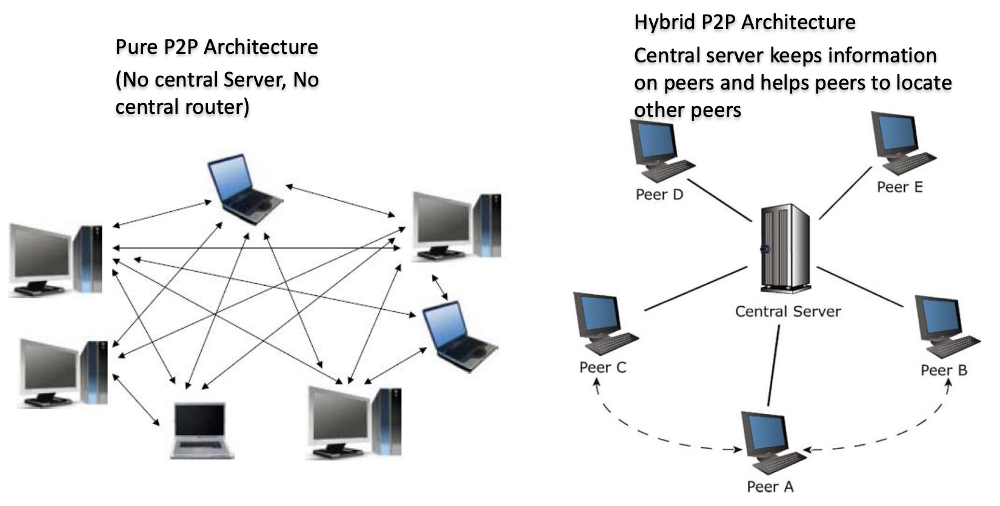
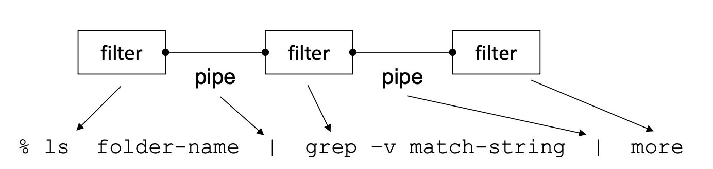

# COMP1531 Week10: Software Architecture

***Software Architecture***:
- Is the “big picture” or macroscopic organization of the
system to be built
- Partition the system in logical ***sub-systems*** or ***parts***, then
provide a high-level view of the system in terms of these
parts and how they relate to form the whole system

Architecture vs Design:
- **Architecture** focuses on non-functional requirements (“cross-cutting concerns”) and decomposition of functional requirements
- **Design** focuses on implementing the functional requirements
- Note: The border is not always sharp

## Decompose System

- Understanding and communication
    - Enables every one to understand how the system works as a whole (various stake-holders, users of the system, developers, architects)
    - Provides an understanding of the macro properties of the system to learn how the system intends to fulfil the key functional and non-functional requirements
    - Pre-determine key system properties (scalability, reliability, performance, usability etc..)
- Tackle complexity by “***divide-and-conquer***” – allow people to work on individual pieces of the system in isolation which can later be integrated to form the final system
- To prepare for extension of the system
    - Support flexibility and future evolution by decoupling unrelated parts, so each can evolve separately (“separation of concerns”)
    - Subsystems envisioned to be part of a future release can be included in the architecture, even though they are not to be developed immediately.
- Focus on creative parts and avoid “reinventing the wheel”
    - Discover components obtained from past projects
    - Identify components that have high potential reusability

    
Some Key questions we are faced with:
Architectural Style:
1. How to decompose the system (into parts)?
2. How the parts relate to one another?
Architectural Views:
1. How to document the system’s software architecture?

### Architectural Style

A software architectural style a family of systems in terms of a pattern of structural organisation.

Basically, an architectural style is defined by:
1. ***Components***: A collection of **computational units** or elements that “do the work” (e.g., classes, databases, tools, processes etc.)
2. ***Connectors***: Enable communication between different components of the system (e.g., function call, remote procedure call, event broadcast etc., ) and uses a specific **protocol**
3. ***Constraints***: Define how the components can be combined to form the system
    - define where data may flow in and out of the components/connectors
    - topological constraints that define the arrangement of the components and connectors

Some Well-Known Architectural Styles: 
- Client/Server
    - (2-tiered, n-tiered or multi-tiered)
    - World Wide Web style
- REST (Representational State Transfer)
- Peer-to-Peer
- Pipe-and-Filter
    - UNIX shell script architectural style
- Central Repository (database)
- Layered

#### Client-Server Architecture

Client-Server Architecture is a basic architectural style for *distributed computing*:
- Two distinct component types:
    - ***Server***: One component that has the role of a server that **provides specific services**, waits for and handles connections e.g., database or file server
    - ***Client***: One component that has the role of a client that initiates connections to **request services** provided by a server
    - Client and Server could be on same machine or different machines
- *Connector* is based on a ***request-response*** model

Examples: File Server, Database server, Email Server

The main disadvantage for Client-Server Architecture is that: once the server goes down, the client cannot get the services any more.

#### P2P Architecture

Problem Context: hope to resolve **network congestion** and **single point of failure** that could result in a client-server model

Each peer component can function as <u>both a *server* and a *client*</u>.

Two kinds of P2P:
- Pure P2P
- Hybrid P2P

#### 3-Tier / N-Tiered Architecture

***N-Tiered Architecture*** separates the deployment of software components into multiple logical layers, so that <u>each tier can be located on a physically separate computer</u>. (improve scalability and stability)

#### Pipe-and-Filter Architectural Style

Problem Context: design a system that is suitable for processing
and transforming data streams, to produce an output stream by suitably
transforming the input data stream

***Pipe-and-Filter Architectural Style*** is often used for processing data and string, which requires little interactions between applications.

- Component: ***Filter***
    - Reads input stream (or streams)
    - Each filter <u>encapsulates a data processing step</u> to transform data and produce output stream (or streams)
- Connector: ***Pipe*** (Serving as a conduit for data)
    - Data transformed by one filter is sent other filters for further processing using the pipe connector

Data processed incrementally as it arrives
- Output can begin before input fully consumed
- Filters must be independent:
    - Filters do not share state
    - Filters do not know upstream or downstream filters

Examples: UNIX shell commands and pipes, *compiler*

Benefits:
- **Easy to understand** the overall input/output behaviour of a system as a simple composition of the behaviours of filters
    - Different data processing steps are decoupled so filters can evolve independently of each other
- Flexible and support reuse - any two filters can be recombined, if they agree on data formats
- Flexible and ease of **maintenance** - filters can be recombined or easily replaced by new filters (completely decoupled)
- Support **concurrent processing** of data streams

Weakness:
- Highly dependent on order of filters - What if an intermediate filter crashes?
- Not appropriate for interactive applications

#### Central Repository Architectural Style (or Shared Data Style)

Problem Context: A complex body of knowledge, that needs to be established, persisted and manipulated in several ways

Examples: graphical editors, IDEs, database applications,
document repositories 

Components: Two distinct types
- Central data repository - A central, reliable, permanent data structure that represents the state of the system
- Data accessors – A collection of independent components that operate on the central data; components do not interact directly but only through the central repository
- Connectors:
    - Read/Write mechanism (e.g., procedure calls or direct memory accesses)
    - Components access repository as and when they want
    - Knowledge sources , do not change the shared data

#### Publish-subscribe style (Event based style)

Two distinct component types
- Publisher: Components that generate or publish events
- Subscribers: Components register their interest in published events and are invoked when these events occur

Examples:
- user interface frameworks
- traders register interest (subscribe to) particular stock prices and receive updates as prices changes
- wireless sensor networks

#### SOA (Service Oriented Architecture)

SOA (Service Oriented Architecture): Software components are created as as autonomous, platform-independent, loosely coupled services and is agnostic of the underlying implementation technology. (<u>usually no user-interface involved</u>)

Examples:
- web service
- Business-to-Business (B2B) services
- Google API

#### Application Architectural Pattern: MVC

Decouple data access, application logic and user interface into three distinct components.

Note: ==MVC is an **application** architectural pattern, not a **software** architectural style.==

### Architectural Views

A ***view*** is a projection of a model showing a subset of its details.

A system’s architecture may need to be expressed in terms of several different views e.g.,
- ***Model view***
- ***Component and Connector view***
- ***Allocation view***
