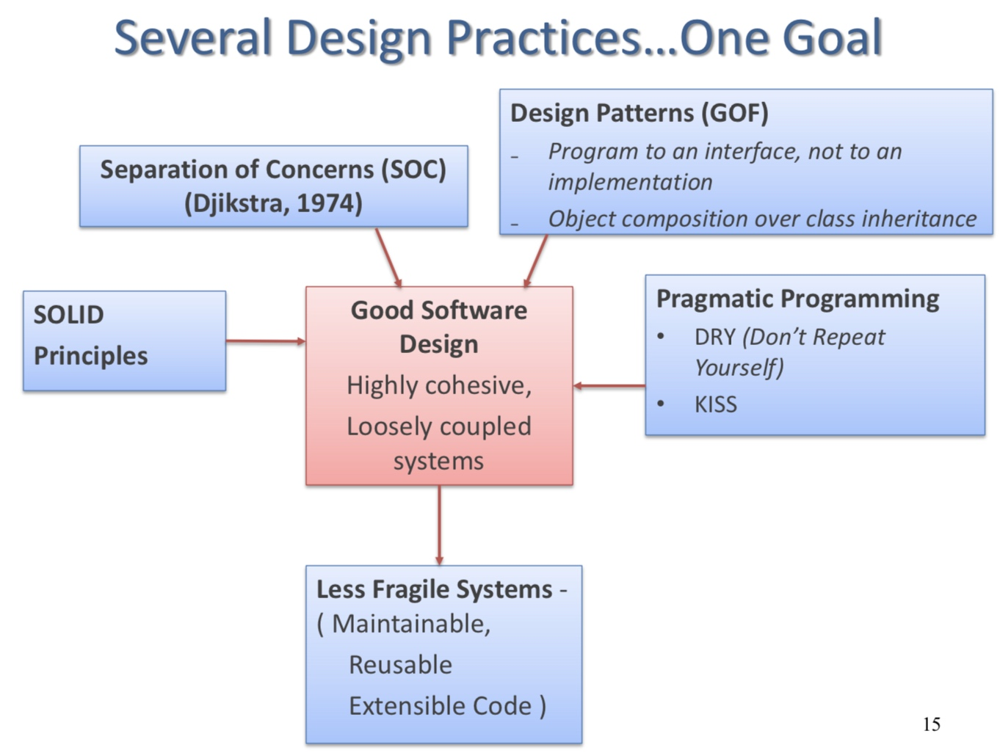
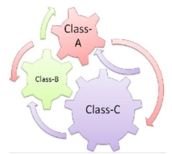
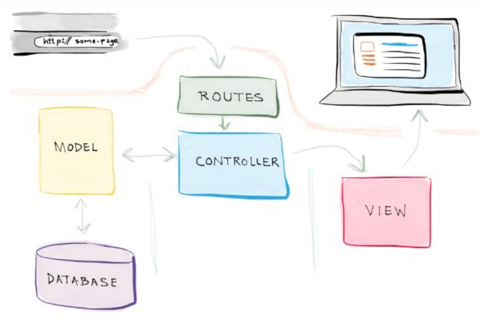

# COMP1531: Week 07 Effective Software Design

## Design Rot

A design smell
- is a symptom of **poor design**
- often caused by violation of **key design principles**
- has structures in software that suggest **refactoring**

### Design Smells

***Rigidity***
- Tendency of the software being <u>too difficult to change</u> even in simple ways
- A single change causes a cascade of changes to other dependent modules

***Fragility***
- Tendency of the software to <u>break in many places</u> when a single change is made 
- e.g. When you change a small piece of codes, a lot of bugs happen.

Rigidity and fragility complement each other – <u>aim towards minimal impact, when a new feature or change is needed.</u>

***Immobility***
- Design is <u>hard to reuse</u>
- Design has parts that could be useful to other systems, but the effort needed and risk in disentangling the system is too high

***Viscosity***
- *Software viscosity* – changes are easier to implement through ‘hacks’ over ‘design preserving methods’
- *Environment viscosity* – development environment is slow and in-efficient

***Opacity***
- Tendency of a module to be <u>difficult to understand</u>
- Code must be written in a clear and expressive manner

***Needless complexity***
- ==<u>Contains constructs that are not currently useful</u>==
- Developers ahead of requirements

***Needless repetition***
- Design contains repeated structures that could potentially be unified under a single abstraction
- Bugs found in repeated units have to be fixed in every repetition

## Refactoring 

The process of restructuring (changing the internal structure of software) software to make it easier to understand and cheaper to modify without changing its external, observable behaviour.

### Characteristics of Good Design

The design quality of software is characterised by
1. ==***Coupling***==
2. ==***Cohesion***==

#### Coupling

***Coupling*** Is defined as the degree of **interdependence** between components or classes
- **High coupling** occurs when one component A depends on the internal workings of another component B and is affected by internal changes to component B

Striking a balance is an art:
- High coupling leads to a complex system, with difficulties in maintenance and extension...eventual software rot
- Aim for **loosely coupled** classes - allows components to be used and modified independently of each other
- But “**zero-coupled**” classes are not usable – There will be no association.

Some examples:
1. if u use attributes in the other classes directly, it is highly coupled. 

#### Cohesion

***Cohesion***: The degree to which all elements of a component or class or module <u>**work together** as a functional unit</u>.

==**Highly cohesive** modules are much easier to <u>maintain</u> and less frequently changed and have higher probability of <u>reusability</u>.==

Think about
- How well the lines of code in a method or function work together to create a sense of purpose?
- How well do the methods and properties of a class work together to define a class and its purpose?
- How well do the classes fit together to create modules?

Again, just like zero-coupling, do not put all the responsibility into a single class to avoid low cohesion!

## SOLID Principles

A set of five guiding design principles to avoid design smells:
- ==SRP: Single Responsibility Principle==
- OCP: Open Closed Principle
- LSP: Liskov Substitution Principle
- ISP: Interface Segregation Principle
- DIP: Dependency Inversion Principle

==Notes: Do not apply SOLID principles when there is no design smell, which will lead to unnecessary complexity.==

### SRP: Single Responsibility Principle

A class should have **one** reason to change.
- Cohesion says: how good a reason the elements of a module have to be in the same module
- Cohesion and SRP: the forces that cause the module to change

Advantages of SRP: 
- **Readability**:
    - Easier to focus on one responsibility and you can identify the responsibility 
- **Reusability**:
    - The code can be re-used in different contexts 
- **Testability**:
    - Each responsibility can be tested in isolation
        - When a class has encapsulates several responsibilities, several test-cases are required

### OCP: Open Closed Principle

Software entities (classes, modules, functions) should be <u>open for extension</u> but <u>closed for modification</u>.
- **Open for extension**: As requirements change, the module can be extended with new behaviours to adapt to the changes
- **Closed for modification**: Extending the behaviour of the module must not require changing the original source, or binary code of the module.

i.e. not change the original codes.

OCP **reduces rigidity**: a change will not cause a cascade of related changes in dependent modules.

How do we implement OCP?
- Using ***abstraction and ==dynamic binding==***
- abstractions are implemented as *abstract base classes*, that are fixed yet, represent an unbounded group of possible behaviours.
- The unbounded group of possible behaviours (or the extensions) are provided by possible *derived classes* (sub-classes)

> Dynamic binding, also known as late binding, is a mechanism by which a computer program waits until runtime to bind the name of a method being called to an actual subroutine.

==We can use an instance as a parameter to implement dynamic binding.==

Adv and dis of OCP:
- **Not Easy**:
    - A skill gained through experience by knowing the users, industry to be able to judge the various kinds of changes
    - Educated guesses could be right or wrong. If wrong, you loose time
- **Expensive**:
    - Abstractions increase the complexity of software design
    - Takes development time and effort to create the appropriate abstraction
    - ==Apply OCP only when it is needed for the first time==
- **Yet yields great benefits**:
    - Flexibility, Reusability and Maintainability

## MVC Model (Model-View-Controller)

MVC: A software architectural pattern that decouples data access, application logic and user interface into three distinct components:

***Model***
- <u>Holds all the data, state</u>, interact with database
- Responds to instructions to change of state (from the controller)
- Responds to requests for information about its state (usually from the view),
- Sends notifications of state changes to “observer” (view)

***Controller***
- <u>**Glue** between user and processing (Model) and formatting (View) logic</u>
- Accepts the user request or inputs to the application, parses them and decides which type of Model or View should be invoked

***View***
- This is the **presentation layer** provides the interaction that the user sees (e.g a web page).
- View component <u>takes inputs from the user and sends actions to the **controller** for manipulating data</u>.
- View is responsible for displaying the results obtained by the controller from the model component in a way that user wants them to see or a pre-determined format.
- The format in which the data can be visible to users can be of any ‘type‘ such as HTML or XML depending upon the presentation tier.
- It is responsibility of the controller to choose a view to display data to the user.