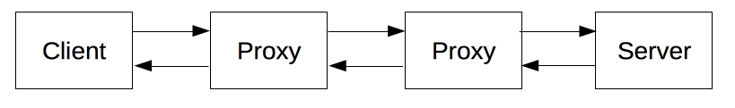

# COMP1531: Week06

## HTTP

***HTTP*** is a <u>client-server protocol</u>: ***request***s are sent by one entity, the user-agent (or a proxy on behalf of it). Each individual request is sent to a server, which will handle it and provide an answer, called the ***response***.

### HTTP Request and Response

A HTTP response consists of:
- Status Code
    - Success: `2xx`
    - Redirection: `3xx`
    - Client-Error: `4xx`
    - Server-Error: `5xx`
- Header
- Optional message
    
### Session state

HTTP is stateless protocol.

But HTTP can use following tools to retain the information:
- Cookies
- Sessions
- Hidden variables